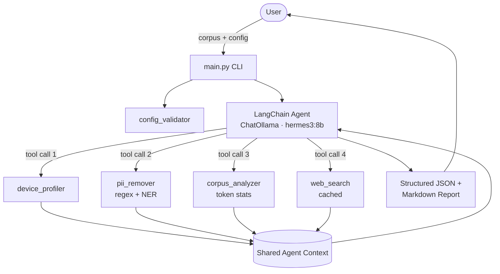

# SmartEmbedAgent

> **An agentic AI system that recommends optimal embedding models by reasoning about your corpus, hardware, and privacy needs.**

[](https://www.python.org/downloads/)
[](LICENSE)
[](#tests)

SmartEmbedAgent profiles your hardware, sanitizes your corpus of PII, analyzes the cleaned text, and uses a **local LLM** (Ollama, Apple Silicon Metal-accelerated) to recommend the right embedding model and chunking strategy for your use case. It picks `BGE-small` for a CPU-only laptop running on a privacy-sensitive corpus, and `BGE-M3` for an M2 Pro indexing long technical documents — and explains why. **No API keys required. Runs fully on-device.**

## Table of Contents

- [Why Agentic](#why-agentic)
- [Architecture](#architecture)
- [Reasoning Decision Points](#reasoning-decision-points)
- [Key Features](#key-features)
- [Installation](#installation)
- [Quick Start](#quick-start)
- [Detailed Usage](#detailed-usage)
- [Configuration](#configuration)
- [Example Outputs](#example-outputs)
- [Comparison: Agentic vs. Deterministic](#comparison-agentic-vs-deterministic)
- [Roadmap](#roadmap)
- [Contributing](#contributing)
- [Acknowledgments](#acknowledgments)
- [License](#license)

## Why Agentic

Picking an embedding model is rarely a one-size-fits-all decision. The right choice depends on:

- **Hardware** — a 1.3 GB model that's GPU-bound is unusable on a CPU laptop.
- **Privacy** — a corpus full of PII shouldn't go through a hosted API.
- **Document length** — a 256-token model and an 8192-token model behave very differently on long documents.
- **Domain** — fine-tuning is worth the effort for legal text but rarely for marketing copy.
- **Cost** — the highest-scoring model on a leaderboard is rarely the most economical to run at scale.

A deterministic script can encode some of this as if/else logic, but the trade-offs don't compose cleanly. Should I upgrade to a long-context model or chunk? Should I fine-tune given my corpus characteristics? Are recent benchmark releases relevant to my domain? These are judgment calls that benefit from reasoning, not rules.

SmartEmbedAgent splits responsibilities accordingly: deterministic Python tools measure facts (RAM, GPU, token counts, PII volume), and a local LLM (Hermes 3 8B via Ollama by default) reasons over those facts to produce an explainable recommendation — entirely on-device.

## Architecture



Tools share state through a module-level `AgentContext` so the corpus and intermediate results don't have to round-trip through the LLM prompt. The agent picks tool order and tool inputs; the tools themselves are deterministic Python.

## Reasoning Decision Points

The local LLM agent makes the following decisions; the rest is deterministic Python code.

| Decision | Why an LLM | Concrete example |
|---|---|---|
| **Chunk vs. upgrade context window** | Cost/latency/accuracy trade-off depends on user's downstream workload, which isn't captured in the corpus alone. | "Your corpus has 30% docs over 2000 tokens. Since you're on an 8GB M1 and latency-sensitive, I recommend chunking with BGE-small rather than switching to a long-context model." |
| **Model pick from candidate pool** | Heuristic ranking is a starting point; LLM can override based on freshness, licensing, domain reputation. | "BGE-small ranks higher than MiniLM by token-fit, but for your medical corpus I'd pick `pritamdeka/PubMedBERT-mnli-snli-stsb` — domain-tuned models matter more than the leaderboard delta here." |
| **Fine-tuning recommendation** | Depends on data volume, label availability, and resource budget — softer signals than the heuristic alone. | "TTR is 0.18 and your top-10 terms are highly concentrated, but you only have 200 documents. I recommend an off-the-shelf model first; revisit fine-tuning if retrieval quality is poor after a baseline run." |
| **When to invoke web search** | Knowing whether benchmark currency matters for the user's situation requires judgment. | "You haven't specified a domain, so I'll skip the web search for domain-specific benchmarks and trust the recent MTEB leaderboard." |
| **Free-form `reasoning_explanation`** | Synthesis in plain language for the user. | (See `docs/DEMO_OUTPUT.md`.) |

The deterministic side handles: hardware enumeration, regex PII detection, token statistics, the `chunking_needed` flag, suggested chunk sizes, and the candidate model pool with hardware/privacy filtering.

For the full breakdown, see [`docs/decision_points.md`](docs/decision_points.md) and [`docs/REASONING_JUSTIFICATION.md`](docs/REASONING_JUSTIFICATION.md).

## Key Features

- **Agentic reasoning, fully local** — a Hermes 3 8B model running on your Mac (via Ollama) weighs hardware, privacy, corpus shape, and domain together rather than applying a fixed scoring function. No API keys, no data leaves your machine.
- **Layered PII removal** — regex (with optional regional packs) + Hugging Face NER for named entities, plus user whitelist + force-redaction list. **India region pack** detects Aadhaar (Verhoeff-validated), PAN, Indian mobile, and vehicle registration numbers — opt in via `pii_settings.region_packs: ["india"]`. **Microsoft Presidio backend** is available as `pip install smart-embed-agent[presidio]` for 50+ additional entity types and confidence-scored detection.
- **Hardware-aware** — `psutil` + `torch` detection with NVIDIA CUDA, AMD ROCm, **Apple Silicon Metal (MPS)**, and CPU fallbacks. Reports unified memory on M-series Macs.
- **Configurable tokenization** — pass the tokenizer matching your target embedding model for exact token counts.
- **Cached web search** — the agent can pull current best-practices and benchmarks; results cached to disk with TTL.
- **Deterministic fallback** — the same JSON schema is emitted by a no-LLM heuristic path. Useful for CI and used automatically when Ollama is unreachable.
- **Structured outputs** — JSON for programmatic use, Markdown report for humans.

## Installation

### Quickstart on Apple Silicon (recommended)

```bash
# 1. Install and start Ollama (the local LLM runtime)
brew install ollama
ollama serve &                       # leave running in the background

# 2. Pull the default reasoning model (~4.9 GB)
ollama pull hermes3:8b

# 3. Install SmartEmbedAgent
git clone https://github.com/varneya/SmartEmbedAgent.git
cd SmartEmbedAgent
python -m venv venv
source venv/bin/activate
pip install -r requirements.txt
```

That's it — no API keys, no signups. The agent uses Apple Silicon's Metal acceleration (MPS) automatically.

### Choosing a different model

Override via env var (no code change needed):

```bash
export SMARTEMBED_LLM_MODEL=qwen3:8b              # better raw reasoning
export SMARTEMBED_LLM_MODEL=qwen3:30b-a3b         # premium quality, 32GB+ Macs
export SMARTEMBED_LLM_MODEL=qwen3:4b              # tiny, fits 8GB Macs
```

### Heuristic-only mode (no LLM needed)

The deterministic fallback works without Ollama, so you can verify your install with:

```bash
make test
```

## Quick Start

```bash
# Run on the included sample corpus
python main.py \
  --corpus_path data/sample_general.txt \
  --config_path config/sample_config.json \
  --output_path runs/recommendation.json \
  --verbose
```

The script prints a step-by-step progress trace and writes:
- `runs/recommendation.json` — structured recommendation for programmatic use
- `runs/recommendation.md` — human-readable report

## Detailed Usage

### CLI flags

| Flag | Default | Purpose |
|---|---|---|
| `--corpus_path` | required | Path to corpus file (`.txt`, `.csv`, `.json`) or directory of `.txt` files. |
| `--config_path` | required | Path to user config JSON (validated against the schema). |
| `--output_path` | `runs/recommendation.json` | Where to write the JSON report. The Markdown report is written alongside. |
| `--verbose` | off | Enable debug-level logging. |
| `--no_llm` | off | Skip the LLM step and use the deterministic heuristic. Useful for CI. |
| `--schema` | `config/config_schema.json` | Override the validation schema. |

### Programmatic use

```python
from src.agent_orchestrator import build_agent, run_pipeline_no_llm

# Deterministic path — no API key required
result = run_pipeline_no_llm(
    corpus="...your text...",
    user_config={"whitelist": ["Acme"], "redaction_list": ["Project Falcon"]},
)

# Agentic path — requires Ollama running locally with hermes3:8b pulled
agent = build_agent(corpus="...", user_config={...})
response = agent.invoke({"input": "Analyze this corpus and recommend a model."})
```

## Configuration

User configuration lives in a single JSON file with four top-level groups: `pii_settings`, `model_preferences`, `hardware_constraints`, and `agent_settings`. See [`docs/CONFIG_GUIDE.md`](docs/CONFIG_GUIDE.md) for full field documentation and [`config/sample_config.json`](config/sample_config.json) for a worked example.

### PII recognizer options

Two optional fields in `pii_settings` control how aggressively PII is detected:

```jsonc
"pii_settings": {
  // ... existing fields ...
  "recognizer": "legacy",       // or "presidio" (requires extras install)
  "region_packs": ["india"]     // optional regional recognizer packs
}
```

- `recognizer: "legacy"` (default) — regex catalog + `dslim/bert-base-NER` for named entities. Lightweight, no extra deps.
- `recognizer: "presidio"` — Microsoft Presidio (50+ entity types, validated detection, confidence scores). Requires `pip install smart-embed-agent[presidio]`. Falls back to legacy if not installed.
- `region_packs: ["india"]` — adds Aadhaar (Verhoeff-validated), PAN, Indian mobile, and vehicle registration recognizers. Apply to either backend.

Validate a config before invoking the agent:

```bash
python -m src.config_validator config/my_config.json
```

## Example Outputs

```bash
# Run on the medical sample (lots of PII, sensitive domain)
python main.py --corpus_path data/sample_medical.txt --config_path config/sample_config.json --no_llm
```

Produces (excerpt):

```json
{
  "recommended_models": [
    {
      "name": "BAAI/bge-small-en-v1.5",
      "rank": 1,
      "rationale": "Context window 512, small (~130 MB). CPU-friendly. Open-source / on-device — privacy-preserving."
    }
  ],
  "reasoning_explanation": "Detected 12 PII redactions (privacy-sensitive). Hosted models filtered out. ...",
  "chunking_strategy": {
    "needed": true,
    "chunk_size_tokens": 384,
    "overlap_tokens": 58
  }
}
```

Full sample runs are in [`docs/DEMO_OUTPUT.md`](docs/DEMO_OUTPUT.md).

## Comparison: Agentic vs. Deterministic

|  | Agentic (this project) | Deterministic script |
|---|---|---|
| **Model pick** | Reasoned over hardware, privacy, domain, freshness | Lookup table or fixed scoring function |
| **Trade-off awareness** | Yes — explains why one option beats another | Implicit in the score |
| **Adapts to new context** | Yes — user's domain, resource limits, latency tolerance | Requires code changes |
| **Explainability** | Free-form `reasoning_explanation` field | Limited to ranked output |
| **Reproducibility** | Variable across runs (LLM is non-deterministic, but `temperature=0`) | Fully reproducible |
| **Cost per recommendation** | Local compute only (no API calls) | Free |
| **Privacy** | Fully on-device — corpus never leaves your machine | Same |
| **Best for** | One-off / occasional analysis where context matters | High-frequency or air-gapped use |

SmartEmbedAgent ships both: the agent for production use, the deterministic fallback for CI and audit.

## Roadmap

- [ ] Web UI for non-technical users
- [ ] WhatsApp / Slack interface for ad-hoc corpus analysis
- [ ] Integration with vector DBs (Pinecone, Weaviate, Qdrant) for end-to-end retrieval evaluation
- [ ] Automatic fine-tuning recipe generation when fine-tuning is recommended
- [ ] Cohere and Voyage as first-class candidates in the agent's pool
- [ ] Notebook of canonical case studies (legal, medical, code, multilingual)

## Contributing

See [`CONTRIBUTING.md`](CONTRIBUTING.md) for development setup, code style, and guidelines for adding new tools to the agent. Please review [`CODE_OF_CONDUCT.md`](CODE_OF_CONDUCT.md) before participating.

## Acknowledgments

- **Ollama** for making local LLM serving on Apple Silicon trivial.
- **Nous Research** for Hermes 3, the default tool-calling reasoning model.
- **Alibaba** for the Qwen 3 family (alternative reasoning models).
- **Hugging Face** for the NER models, tokenizers, and the `transformers` ecosystem.
- **BAAI** for the BGE family of embedding models.
- **Nomic AI** for `nomic-embed-text-v1.5`.
- **mixedbread.ai** for `mxbai-embed-large-v1`.
- **`dslim`** for `dslim/bert-base-NER`, the default NER model used in the PII pipeline.
- The **LangChain** project for the agent framework that ties everything together.

## License

MIT — see [`LICENSE`](LICENSE).
