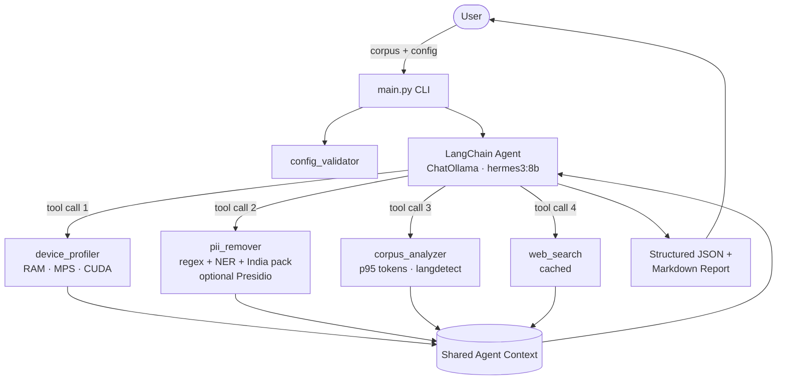

# SmartEmbedAgent

> **An agentic AI system that recommends optimal embedding models by reasoning about your corpus, hardware, and privacy needs.**

[](https://www.python.org/downloads/)
[](LICENSE)
[](#tests)

SmartEmbedAgent profiles your hardware, sanitizes your corpus of PII (Indian recognizers — Aadhaar/PAN/etc. — included by default), analyzes the cleaned text, and uses a **local LLM** (Ollama, Apple Silicon Metal-accelerated) to recommend the right embedding model and chunking strategy for your use case. It picks `BGE-small` for a CPU-only laptop running on a privacy-sensitive corpus, and `nomic-embed-text-v1.5` for a long-document corpus on an M-series Mac — and explains why, with concrete numbers (index size, embed throughput, query latency, suggested reranker). **No API keys required. Runs fully on-device.**

Optional [OpenClaw](https://openclaw.ai) skill ships in the repo so you can ask for recommendations from WhatsApp, Telegram, Signal, iMessage, etc.

## Table of Contents

- [Why Agentic](#why-agentic)
- [Architecture](#architecture)
- [Reasoning Decision Points](#reasoning-decision-points)
- [Key Features](#key-features)
- [Installation](#installation)
- [Quick Start](#quick-start)
- [Detailed Usage](#detailed-usage)
- [Configuration](#configuration)
- [Example Outputs](#example-outputs)
- [Chat-app integration (WhatsApp / Telegram / Signal via OpenClaw)](#chat-app-integration-whatsapp--telegram--signal-via-openclaw)
- [Comparison: Agentic vs. Deterministic](#comparison-agentic-vs-deterministic)
- [Roadmap](#roadmap)
- [Contributing](#contributing)
- [Acknowledgments](#acknowledgments)
- [License](#license)

## Why Agentic

Picking an embedding model is rarely a one-size-fits-all decision. The right choice depends on:

- **Hardware** — a 1.3 GB model that's GPU-bound is unusable on a CPU laptop.
- **Privacy** — a corpus full of PII shouldn't go through a hosted API.
- **Document length** — a 256-token model and an 8192-token model behave very differently on long documents.
- **Domain** — fine-tuning is worth the effort for legal text but rarely for marketing copy.
- **Cost** — the highest-scoring model on a leaderboard is rarely the most economical to run at scale.

A deterministic script can encode some of this as if/else logic, but the trade-offs don't compose cleanly. Should I upgrade to a long-context model or chunk? Should I fine-tune given my corpus characteristics? Are recent benchmark releases relevant to my domain? These are judgment calls that benefit from reasoning, not rules.

SmartEmbedAgent splits responsibilities accordingly: deterministic Python tools measure facts (RAM, GPU, token counts, PII volume), and a local LLM (Hermes 3 8B via Ollama by default) reasons over those facts to produce an explainable recommendation — entirely on-device.

## Architecture



Tools share state through a module-level `AgentContext` so the corpus and intermediate results don't have to round-trip through the LLM prompt. The agent picks tool order and tool inputs; the tools themselves are deterministic Python.

## Reasoning Decision Points

The local LLM agent makes the following decisions; the rest is deterministic Python code.

| Decision | Why an LLM | Concrete example |
|---|---|---|
| **Chunk vs. upgrade context window** | Cost/latency/accuracy trade-off depends on user's downstream workload, which isn't captured in the corpus alone. | "Your corpus has 30% docs over 2000 tokens. Since you're on an 8GB M1 and latency-sensitive, I recommend chunking with BGE-small rather than switching to a long-context model." |
| **Model pick from candidate pool** | Heuristic ranking is a starting point; LLM can override based on freshness, licensing, domain reputation. | "BGE-small ranks higher than MiniLM by token-fit, but for your medical corpus I'd pick `pritamdeka/PubMedBERT-mnli-snli-stsb` — domain-tuned models matter more than the leaderboard delta here." |
| **Fine-tuning recommendation** | Depends on data volume, label availability, and resource budget — softer signals than the heuristic alone. | "TTR is 0.18 and your top-10 terms are highly concentrated, but you only have 200 documents. I recommend an off-the-shelf model first; revisit fine-tuning if retrieval quality is poor after a baseline run." |
| **When to invoke web search** | Knowing whether benchmark currency matters for the user's situation requires judgment. | "You haven't specified a domain, so I'll skip the web search for domain-specific benchmarks and trust the recent MTEB leaderboard." |
| **Free-form `reasoning_explanation`** | Synthesis in plain language for the user. | (See `docs/DEMO_OUTPUT.md`.) |

The deterministic side handles: hardware enumeration, regex PII detection, token statistics, the `chunking_needed` flag, suggested chunk sizes, and the candidate model pool with hardware/privacy filtering.

For the full breakdown, see [`docs/decision_points.md`](docs/decision_points.md) and [`docs/REASONING_JUSTIFICATION.md`](docs/REASONING_JUSTIFICATION.md).

## Key Features

- **Agentic reasoning, fully local** — a Hermes 3 8B model on your Mac (via Ollama) weighs hardware, privacy, corpus shape, and domain together rather than applying a fixed scoring function. No API keys, no data leaves your machine.
- **Layered PII removal** — regex + Hugging Face NER + user whitelist + force-redaction list. **India region pack on by default** — detects Aadhaar (Verhoeff-validated, so random 12-digit IDs aren't false-flagged), PAN, Indian mobile, and vehicle registration numbers. **Microsoft Presidio backend** is opt-in via `requirements-presidio.txt` for 50+ additional entity types and confidence-scored detection.
- **Hardware-aware** — `psutil` + `torch` detection with NVIDIA CUDA, AMD ROCm, **Apple Silicon Metal (MPS)**, and CPU fallbacks. Reports unified memory on M-series Macs.
- **Token percentiles, not just mean** — recommendation drives off `p95` token length, not the mean (which is biased by long-tail outliers). A corpus with `mean=100` but `p95=4000` still triggers chunking.
- **Multilingual-aware** — `langdetect` runs on a corpus sample; if multilingual or non-Latin script is detected, the recommender automatically prefers `bge-m3` / `multilingual-e5-large` over English-only models.
- **Concrete index/throughput estimates** — every recommendation includes vector dimension, full-corpus embed time, query-embed latency, and predicted index size in MB. Replaces "fits comfortably" hand-waves.
- **Prompt-prefix templates** — BGE / Nomic / E5 etc. require specific `"search_document: "` / `"Represent this sentence..."` prefixes to hit their published quality numbers. The recommendation surfaces the exact strings to prepend at index/query time.
- **Reranker recommendation** — embedding retrieval typically caps at ~70% recall@10. Each output suggests a paired cross-encoder reranker (`bge-reranker-base` for English, `bge-reranker-v2-m3` for multilingual) so you don't ship a half-built pipeline.
- **Multi-source corpora** — `--corpus_path` accepts multiple files (`.txt`, `.md`, `.csv`, `.json`) or directories with mixed types. Files that fail to parse are skipped with a warning, not a crash.
- **Configurable tokenization** — pass the tokenizer matching your target embedding model for exact token counts.
- **Cached web search** — the agent can pull current best-practices and benchmarks; results cached to disk with TTL.
- **Deterministic fallback** — the same JSON schema is emitted by a no-LLM heuristic path. Useful for CI and used automatically when Ollama is unreachable.
- **Structured outputs** — JSON for programmatic use, Markdown report for humans, and chat-formatted summary when invoked through OpenClaw.

## Installation

### Quickstart on Apple Silicon (recommended)

```bash
# 1. Install and start Ollama (the local LLM runtime)
brew install ollama
ollama serve &                       # leave running in the background

# 2. Pull the default reasoning model (~4.9 GB)
ollama pull hermes3:8b

# 3. Install SmartEmbedAgent
git clone https://github.com/varneya/SmartEmbedAgent.git
cd SmartEmbedAgent
python -m venv venv
source venv/bin/activate
pip install -r requirements.txt
```

That's it — no API keys, no signups. The agent uses Apple Silicon's Metal acceleration (MPS) automatically.

### Choosing a different model

Override via env var (no code change needed):

```bash
export SMARTEMBED_LLM_MODEL=qwen3:8b              # better raw reasoning
export SMARTEMBED_LLM_MODEL=qwen3:30b-a3b         # premium quality, 32GB+ Macs
export SMARTEMBED_LLM_MODEL=qwen3:4b              # tiny, fits 8GB Macs
```

### Heuristic-only mode (no LLM needed)

The deterministic fallback works without Ollama, so you can verify your install with:

```bash
make test
```

## Quick Start

```bash
# Run on the included sample corpus
python main.py \
  --corpus_path data/sample_general.txt \
  --config_path config/sample_config.json \
  --output_path runs/recommendation.json \
  --verbose
```

The script prints a step-by-step progress trace and writes:
- `runs/recommendation.json` — structured recommendation for programmatic use
- `runs/recommendation.md` — human-readable report

## Detailed Usage

### CLI flags

| Flag | Default | Purpose |
|---|---|---|
| `--corpus_path` | required | One or more paths. Each may be a file (`.txt`, `.md`, `.csv`, `.json`) or a directory containing any mix of those types. Multiple paths concatenate into a single corpus. |
| `--config_path` | required | Path to user config JSON (validated against the schema). |
| `--output_path` | `runs/recommendation.json` | Where to write the JSON report. The Markdown report is written alongside. |
| `--verbose` | off | Enable debug-level logging. |
| `--no_llm` | off | Skip the LLM step and use the deterministic heuristic. Useful for CI or when Ollama isn't installed. |
| `--schema` | `config/config_schema.json` | Override the validation schema. |

Examples:

```bash
# Single file
python main.py --corpus_path data/sample_long.txt --config_path config/sample_config.json

# Multiple files of mixed types
python main.py --corpus_path notes.md reviews.csv ~/dump/scrape.json --config_path config/sample_config.json

# A directory containing .txt + .md + .csv + .json
python main.py --corpus_path ~/data/customer_notes/ --config_path config/sample_config.json
```

### Programmatic use

```python
from src.agent_orchestrator import build_agent, run_pipeline_no_llm

# Deterministic path — no API key required
result = run_pipeline_no_llm(
    corpus="...your text...",
    user_config={"whitelist": ["Acme"], "redaction_list": ["Project Falcon"]},
)

# Agentic path — requires Ollama running locally with hermes3:8b pulled
agent = build_agent(corpus="...", user_config={...})
response = agent.invoke({"input": "Analyze this corpus and recommend a model."})
```

## Configuration

User configuration lives in a single JSON file with four top-level groups: `pii_settings`, `model_preferences`, `hardware_constraints`, and `agent_settings`. See [`docs/CONFIG_GUIDE.md`](docs/CONFIG_GUIDE.md) for full field documentation and [`config/sample_config.json`](config/sample_config.json) for a worked example.

### Task selection (`model_preferences.task`)

The single most important field for picking a model — it tells the recommender what the embeddings will actually be used for. **`retrieval` (default)** is asymmetric search; the others are symmetric and turn off the prefix and reranker logic that only makes sense for retrieval.

```jsonc
"model_preferences": {
  "task": "retrieval"   // retrieval | classification | clustering | deduplication | similarity
}
```

| Task | Symmetric? | Prefixes? | Reranker? | Bias |
|---|---|---|---|---|
| `retrieval` | no (asymmetric) | yes (BGE/Nomic/E5 prefixes surface) | yes (`bge-reranker-base` paired) | match context window to corpus p95 |
| `classification` | yes | no | no | prefer dim≥768 (denser separation for linear heads) |
| `clustering` | yes | no | no | prefer compact (cheaper centroid math at scale) |
| `deduplication` | yes | no | no | prefer smallest fast models (large index, batch indexing) |
| `similarity` | yes | no | no | prefer paraphrase-tuned (mpnet variants) |

In the FastAPI UI, pick from the **Task** dropdown above the file uploader. Programmatically:

```bash
curl -X POST http://localhost:8000/recommend \
  -H 'Content-Type: application/json' \
  -d '{"corpus_text":"...", "task":"clustering", "use_llm":false}'

curl -X POST http://localhost:8000/recommend/upload \
  -F files=@notes.csv -F use_llm=false -F task=deduplication
```

Backward compat: the legacy `model_preferences.target_use_case` field still works and maps to the closest `task` value (e.g. `semantic_search` → `retrieval`).

### PII recognizer options

Two `pii_settings` fields control PII detection:

```jsonc
"pii_settings": {
  // ... existing fields ...
  "recognizer": "legacy",       // or "presidio" (requires extras install)
  "region_packs": ["india"]     // ON BY DEFAULT in sample_config.json
}
```

- `recognizer: "legacy"` (default) — regex catalog + `dslim/bert-base-NER`. Lightweight, no extra deps.
- `recognizer: "presidio"` — Microsoft Presidio (50+ entity types, validated detection, confidence scores). Requires the optional install:
  ```bash
  pip install -r requirements-presidio.txt
  python -m spacy download en_core_web_lg
  ```
  Falls back to `legacy` (with a warning in the report) if Presidio isn't installed.
- `region_packs: ["india"]` — Aadhaar (Verhoeff-validated), PAN, Indian mobile, and vehicle registration. **On by default** in `sample_config.json` because the recognizers are cheap and add real value for any India-related corpus.

Each redaction report carries `recognizer_used` and `region_packs` so audit logs record which detector caught each entity.

Validate a config before invoking the agent:

```bash
python -m src.config_validator config/my_config.json
```

## Example Outputs

```bash
python main.py --corpus_path data/sample_long.txt --config_path config/sample_config.json --no_llm
```

Produces (excerpt — full schema):

```json
{
  "recommended_models": [
    {
      "name": "BAAI/bge-small-en-v1.5",
      "rank": 1,
      "rationale": "Context window 512, dim 384, 130 MB. CPU-friendly. English-only. Open-source / on-device — privacy-preserving.",
      "dimension": 384,
      "context_window": 512,
      "size_mb": 130,
      "multilingual": false,
      "embed_prefix": "",
      "query_prefix": "Represent this sentence for searching relevant passages: "
    }
  ],
  "reasoning_explanation": "Detected 1 PII redactions (standard privacy). Corpus: 10 documents, p50=88 / p95=180 / p99=476 tokens. No chunking required. Primary language: en.",
  "chunking_strategy": {
    "needed": false,
    "chunk_size_tokens": null,
    "overlap_tokens": null,
    "rationale": "p95 doc length is 180 tokens — fits within compact-model context windows."
  },
  "fine_tuning_advice": "Recommended. The corpus has low lexical diversity (TTR < 0.2) and concentrated domain terminology, both signals that domain adaptation via fine-tuning or contrastive training would improve retrieval quality.",
  "hardware_fit_analysis": "Total RAM: 48.0 GB. Apple Silicon (Apple M4 Max) with 48.0 GB unified memory. Top recommendation 'BAAI/bge-small-en-v1.5' is 130 MB — fits comfortably.",
  "index_estimate": {
    "vector_dim": 384,
    "index_size_human": "11 MB",
    "embed_throughput_docs_per_sec": 500,
    "estimated_full_embed_seconds": 12.8,
    "estimated_query_embed_ms": 2.0
  },
  "reranker_recommendation": {
    "name": "BAAI/bge-reranker-base",
    "size_mb": 280,
    "why": "Cross-encoder reranker over top-K retrieved candidates. English-only and lightweight. Adds ~30-60ms per query for top-50 reranking and typically lifts recall@10 by 10-20 percentage points."
  },
  "language_profile": {
    "languages": [{"code": "en", "share": 1.0}],
    "multilingual": false,
    "non_latin_present": false,
    "detector": "langdetect"
  }
}
```

Full sample runs are in [`docs/DEMO_OUTPUT.md`](docs/DEMO_OUTPUT.md).

## Run as an HTTP service (FastAPI)

For browser users or programmatic API consumers, the same recommender is exposed over HTTP with a small FastAPI app and a Tailwind-styled in-browser UI. Optional install — purely additive to the CLI / library / OpenClaw skill.

```bash
pip install -r requirements-api.txt   # fastapi + uvicorn + multipart, ~30 MB

# Easiest — run the module directly (works without a package install):
python -m src.api.server                # serves on http://127.0.0.1:8000

# Or, after a package install (`pip install -e .`), use the console-script:
smart-embed-agent-serve
```

Open `http://localhost:8000` in a browser for the upload-and-recommend UI (drag-drop a corpus file, optionally toggle the LLM agent, see ranked models, index size, throughput estimate, reranker, language profile, and download the Markdown report).

Programmatic use:

```bash
# JSON in / JSON out
curl -X POST http://localhost:8000/recommend \
  -H 'Content-Type: application/json' \
  -d '{"corpus_text":"alice@example.com is great","use_llm":false}'

# Multipart upload
curl -X POST http://localhost:8000/recommend/upload \
  -F files=@notes.csv -F files=@reviews.md -F use_llm=false

# Auto-generated OpenAPI docs
open http://localhost:8000/docs
```

| Endpoint | Method | Purpose |
|---|---|---|
| `/` | GET | In-browser HTML form |
| `/recommend` | POST | JSON body: `corpus_text` or `corpus_paths`, optional inline `config`, `use_llm` |
| `/recommend/upload` | POST | Multipart files (+ optional config_file). Same response shape |
| `/recommend/markdown` | GET | Convenience: runs the bundled sample corpus, returns Markdown |
| `/healthz` | GET | Liveness + reports whether Ollama is reachable |
| `/docs` | GET | FastAPI's auto-generated OpenAPI / Swagger UI |

Env vars: `HOST` (default `127.0.0.1`), `PORT` (default `8000`), `RELOAD` (default `false`).

### Security: localhost-only by default

The HTTP service is **designed to run on `127.0.0.1` only**. There is no built-in authentication, and the API has surface area (file paths, file uploads, `exec` of the LLM agent) that should never face the public internet without an auth proxy in front.

**Hardening that ships in the box** (no extra config needed):

| Defense | What it blocks | Tunable |
|---|---|---|
| Default bind `127.0.0.1` | Any non-loopback caller | `HOST=...` (don't unless you know what you're doing) |
| **Corpus path allowlist** | `POST /recommend` with `corpus_paths` outside `~`, `/tmp`, `/Volumes`, `data/` returns `403`. `..` traversal and symlink-escape both defeated by `Path.resolve()` before the prefix check. | `SMARTEMBED_ALLOWED_CORPUS_ROOTS=/path1:/path2` (colon-separated) |
| **Upload size cap** | `POST /recommend/upload` aborts with `413` once the aggregate exceeds 100 MB | `SMARTEMBED_MAX_UPLOAD_MB=200` |
| **Filename sanitization on uploads** | `..`-style escapes in upload filenames | (always on; uses `Path(name).name`) |
| **Safe DOM construction in the UI** | XSS via LLM-generated text in the result panel | (always on; uses `textContent` rather than `innerHTML` for response data) |

**If you ever want to expose the API externally**, do at least one of:

1. Front it with a reverse proxy that adds OIDC / bearer-token auth (Caddy, nginx + oauth2-proxy, Cloudflare Access)
2. Tunnel via something with auth built in (Tailscale + ACL)
3. Add an API-key check directly in the FastAPI app (simple `Depends`-based middleware)

We do **not** recommend running this without auth on a public IP — even with the path allowlist, the rest of the surface (LLM agent invocations, deterministic compute) is unbounded and DoS-friendly.

## Chat-app integration (WhatsApp / Telegram / Signal via OpenClaw)

If you have [OpenClaw](https://openclaw.ai) installed, this repo ships a ready-to-use skill that lets you ask for recommendations from any chat app OpenClaw supports. The flow:

> *(WhatsApp)* "Recommend an embedding model for `~/data/customer_reviews.csv`"
>
> *(reply, ~30s)*
> 🧭 Top: `BAAI/bge-small-en-v1.5` — Context window 512, dim 384, 130 MB. CPU-friendly. English-only.
> ⚙️ Chunking: no
> 💾 Hardware: M4 Max + 48 GB unified memory. Top recommendation 130 MB — fits comfortably.
> 🎯 Fine-tuning: Recommended. Corpus has low lexical diversity (TTR < 0.2)…
> 📊 Index estimate: 11 MB (dim 384); embed full corpus ~12.8s; query embed ~2ms
> 🎚️ Reranker: `BAAI/bge-reranker-base` (~280 MB)
> 📚 Language: en (100%)

Setup:

```bash
# 1. Install OpenClaw and link a chat channel (e.g. WhatsApp)
brew install openclaw   # or per https://openclaw.ai
openclaw channels login --channel whatsapp

# 2. Install the skill (symlink or copy)
ln -s "$SMARTEMBED_HOME/integrations/openclaw" \
      ~/.openclaw/skills/recommend-embedding-model
echo 'export SMARTEMBED_HOME=~/path/to/SmartEmbedAgent' >> ~/.zshrc
launchctl setenv SMARTEMBED_HOME "$SMARTEMBED_HOME"   # for the gateway service

# 3. Bigger model recommended for skill invocation reliability
ollama pull qwen2.5:32b
openclaw models set ollama/qwen2.5:32b
```

See [`integrations/openclaw/README.md`](integrations/openclaw/README.md) for the full setup guide and [`integrations/openclaw/SKILL.md`](integrations/openclaw/SKILL.md) for the skill manifest.

## Comparison: Agentic vs. Deterministic

|  | Agentic (this project) | Deterministic script |
|---|---|---|
| **Model pick** | Reasoned over hardware, privacy, domain, freshness | Lookup table or fixed scoring function |
| **Trade-off awareness** | Yes — explains why one option beats another | Implicit in the score |
| **Adapts to new context** | Yes — user's domain, resource limits, latency tolerance | Requires code changes |
| **Explainability** | Free-form `reasoning_explanation` field | Limited to ranked output |
| **Reproducibility** | Variable across runs (LLM is non-deterministic, but `temperature=0`) | Fully reproducible |
| **Cost per recommendation** | Local compute only (no API calls) | Free |
| **Privacy** | Fully on-device — corpus never leaves your machine | Same |
| **Best for** | One-off / occasional analysis where context matters | High-frequency or air-gapped use |

SmartEmbedAgent ships both: the agent for production use, the deterministic fallback for CI and audit.

## Roadmap

- [x] **WhatsApp / Telegram / Signal / iMessage interface** — shipped via the OpenClaw skill at [`integrations/openclaw/`](integrations/openclaw/)
- [x] **Apple Silicon Metal (MPS) acceleration**
- [x] **Indian PII detection** (Aadhaar with Verhoeff, PAN, vehicle reg, Indian mobile)
- [x] **Microsoft Presidio backend** (opt-in)
- [x] **Token-percentile-driven chunking decision** + multilingual-aware model selection
- [x] **Index size + throughput estimate** + reranker recommendation in the output
- [ ] **`--evaluate` flag** for empirical model bake-off — sample held-out docs, generate queries via the local LLM, score recall@10 across the top-3 candidates
- [ ] **Near-duplicate detection** at corpus-load time (MinHash/SimHash) with dedupe suggestion
- [ ] **Per-source breakdown** when the corpus has multiple sources (e.g. `Reddit reviews 2x longer than BikeWale; chunk those`)
- [ ] **Vector store recommendation** (FAISS / Chroma / Qdrant) based on corpus size + write pattern
- [ ] **Web UI** for non-technical users
- [ ] **Automatic fine-tuning recipe generation** when fine-tuning is recommended
- [ ] **Notebook of canonical case studies** (legal, medical, code, multilingual)

## Contributing

See [`CONTRIBUTING.md`](CONTRIBUTING.md) for development setup, code style, and guidelines for adding new tools to the agent. Please review [`CODE_OF_CONDUCT.md`](CODE_OF_CONDUCT.md) before participating.

## Acknowledgments

- **Ollama** for making local LLM serving on Apple Silicon trivial.
- **Nous Research** for Hermes 3, the default tool-calling reasoning model.
- **Alibaba** for the Qwen 2.5 / Qwen 3 family (recommended for skill invocation; `qwen2.5:32b` is the default for the OpenClaw integration).
- **OpenClaw** for the multi-channel chat-app agent runtime that the WhatsApp / Signal / Telegram integration is built on.
- **Microsoft Presidio** for the optional 50+-entity PII recognizer.
- **`langdetect`** for the language-profile detector behind multilingual-aware model selection.
- **Hugging Face** for the NER models, tokenizers, and the `transformers` ecosystem.
- **BAAI** for the BGE / BGE-M3 / BGE-Reranker families.
- **Nomic AI** for `nomic-embed-text-v1.5`.
- **mixedbread.ai** for `mxbai-embed-large-v1`.
- **`intfloat`** for the E5 family (multilingual variant powers multilingual corpora).
- **`dslim`** for `dslim/bert-base-NER`, the default NER model used in the legacy PII pipeline.
- The **LangChain** project for the agent framework.
- The **Verhoeff algorithm** (Jacobus Verhoeff, 1969) — quietly filtering ~90% of false-positive Aadhaar matches so order IDs don't get redacted as PII.

## License

MIT — see [`LICENSE`](LICENSE).
