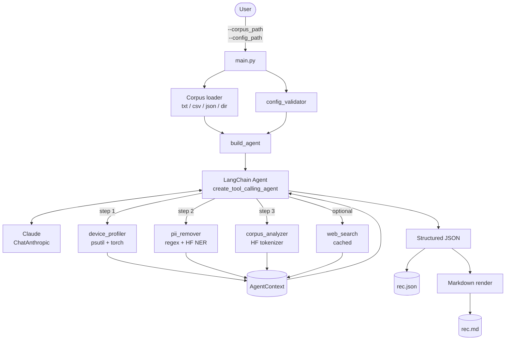
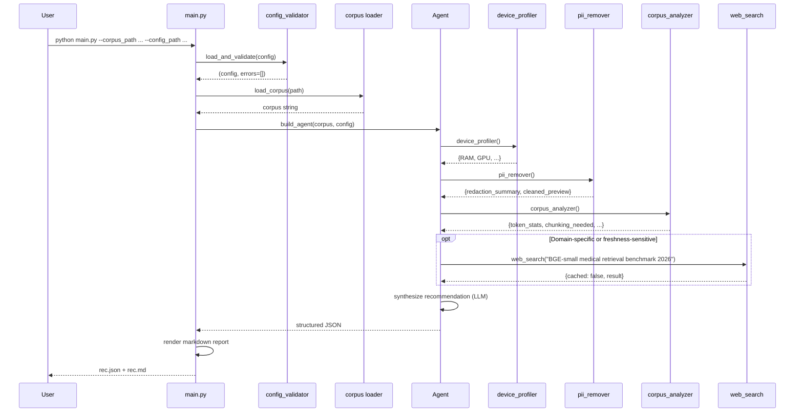
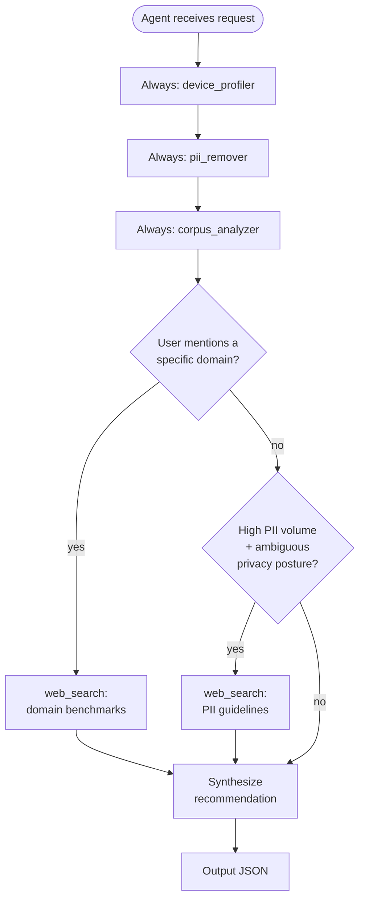

# Architecture

SmartEmbedAgent is structured as a thin CLI on top of a LangChain agent that orchestrates four tools. Tools are deterministic Python; the agent contributes judgment.

## High-level data flow



## Component descriptions

### `main.py`
CLI entry point. Parses arguments, validates the config, loads the corpus from one of the supported formats, builds the agent (or runs the deterministic fallback), invokes it with retry/backoff for transient LLM failures, and writes the JSON + Markdown outputs.

### `src/config_validator.py`
JSON-Schema-style validator with concise error reporting and adapters that flatten the nested user config into the shape the individual modules expect. Runs in <10ms.

### `src/device_profiler.py`
Inspects the host hardware via `psutil` and `torch.cuda`. Returns a fixed-shape dictionary with RAM stats, GPU presence/name/memory, and the active compute device (`cuda` / `rocm` / `cpu`). All GPU code paths are wrapped in try/except so a broken GPU stack degrades to CPU.

### `src/pii_remover.py`
Two-stage redaction. Stage 1 is regex for emails, phones, SSNs, credit cards, and IP addresses with carefully-tuned patterns. Stage 2 is a Hugging Face token-classification pipeline (default `dslim/bert-base-NER`) that catches PERSON / LOCATION / ORGANIZATION entities. User whitelist exempts strings from both stages; user redaction list force-redacts regardless of detection confidence. The "carry-forward" pass redacts repeat occurrences of the same name consistently across the document.

### `src/corpus_analyzer.py`
After cleaning, computes token statistics using a configurable Hugging Face tokenizer (default `bert-base-uncased`, with `tiktoken` and whitespace fallbacks). Returns a structured analysis with token stats, context-window fit at 512/1024/2048/4096/8192 tokens, a chunking decision, vocabulary metrics (TTR), and domain-frequency indicators.

### `src/agent_orchestrator.py`
Wraps the above modules as `StructuredTool` objects with Pydantic input schemas. Builds the agent via `create_tool_calling_agent` with a Claude (`ChatAnthropic`) backend by default. Provides a file-backed `WebSearch` tool with TTL-based caching, plus a deterministic `run_pipeline_no_llm` fallback that emits the same recommendation schema.

## Sequence: a typical run



## Decision tree: which tool fires when



The first three steps are required; the fourth (web search) fires only when the agent judges that benchmark or guideline currency materially affects the recommendation. This keeps the latency of typical runs low while preserving the option to consult external information when it would change the answer.

## Reasoning trace example

A trimmed transcript from a medical-corpus run:

```
> Entering agent...
[Tool call] device_profiler() -> {"total_ram_gb": 16.0, "gpu_available": false, "compute_device": "cpu"}
[Tool call] pii_remover() -> {"summary": {"NAME": 4, "EMAIL": 2, "PHONE": 1}, "total_redactions": 7}
[Tool call] corpus_analyzer() -> {"doc_count": 10, "token_stats": {"mean": 287.4, "max": 612}, "chunking_needed": false}
[Reasoning] Privacy-sensitive corpus (medical, 7 redactions) on CPU-only hardware.
            Ruling out hosted APIs. p95 token length is well within 512.
[Tool call] web_search("BGE-small vs PubMedBERT medical retrieval 2026") -> {cached: false, result: "..."}
[Reasoning] PubMedBERT is well-regarded but a 110M-param model on CPU is slow.
            Recommending BGE-small as primary with PubMedBERT as a domain-tuned alternative.
[Output JSON] {...}
```

The mix of deterministic tool output and free-form reasoning is what distinguishes this from a hard-coded scoring function: the LLM sees the same data the heuristic sees, but it can also incorporate context from web search and frame trade-offs in language the user can engage with.

## Why this shape

- **Tools own measurement, agent owns judgment.** Token counts, RAM, and PII detection are factual operations and belong outside the LLM. Picking which model to recommend involves trade-offs that are well-suited to LLM reasoning.
- **Privacy first.** PII removal runs *before* corpus analysis, so token counts and recommendations are based on the data that will actually be embedded — not the raw input.
- **Local-by-default.** The deterministic fallback path means the project is fully demonstrable without external API access.

## Extension points

- Swap the NER model by setting `pii_settings.ner_model_choice` in the user config.
- Add an embedding model to the recommendation pool by extending the candidate list in `agent_orchestrator.synthesize_heuristic_recommendation`.
- Replace the LLM by passing any LangChain `BaseLanguageModel` to `build_agent(llm=...)`.
- Add a new tool by following the steps in `CONTRIBUTING.md`.
